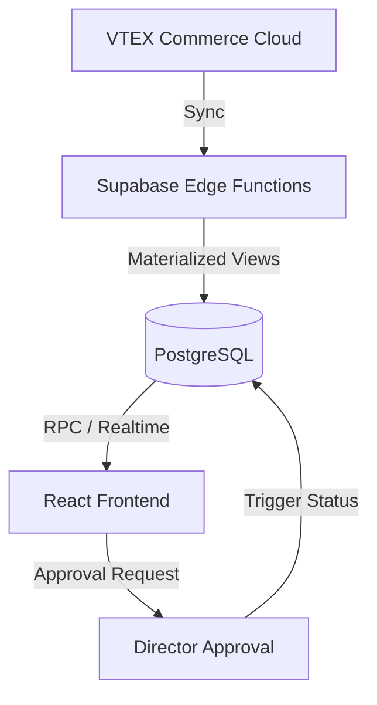

# Pardis SellerFlow

> A high-performance B2B Quotation Management Portal bridging VTEX Commerce and Supabase.

Pardis SellerFlow is a specialized micro-service designed to empower B2B sales teams with complex pricing logic, automated tax calculations, and a streamlined approval workflow.

---

## 🏗️ Technical Architecture

### Core Stack
- **Frontend**: React 18 + Vite + TypeScript.
- **Styling**: TailwindCSS + shadcn/ui (customized for high-fidelity B2B dashboards).
- **Backend-as-a-Service**: Supabase (PostgreSQL, Realtime, Auth).
- **Integration Layer**: Supabase Edge Functions (TypeScript/Deno) for VTEX syncing.
- **Domain Logic**: Decoupled `PricingService` for precise packaging/unit B2B calculations.

### System Design


---

## 💎 Key Features & UX Standards

### 1. B2B Pricing Engine
- **Packaging-First Display**: Sellers focus on packaging totals, while the engine handles unit breakdowns and tax implications (ST, ICMS, etc. - extensible via RPC).
- **Dynamic Pricing Modes**: Integrated directly into the product selector, allowing instant switches between Discount-based and Manual-override pricing.
- **Margin Security**: Advanced permission logic hides numeric margins from sellers, showing only qualitative "Clearance" badges (Authorized/Pending) to maintain profit confidentiality.

### 2. VTEX Integration
- **Materialized Catalog**: Data from VTEX (Products, SKUs, Prices, Inventory) is normalized into Supabase views for sub-second search performance.
- **Automated Sync**: Edge Functions handle periodic and manual data refreshes from VTEX Master Data and Catalog APIs.

---

## 🚀 Development

### Prerequisites
- Node.js 18+
- Supabase CLI (if working on local DB)

### Setup
1. **Clone & Install**:
   ```bash
   git clone <repo-url>
   npm install
   ```

2. **Environment Configuration**:
   Create a `.env.local` file:
   ```env
   VITE_SUPABASE_URL="https://your-project.supabase.co"
   VITE_SUPABASE_PUBLISHABLE_KEY="your-anon-key"
   ```

3. **Run**:
   ```bash
   npm run dev
   ```

### Project Structure
- `/src/pages/seller-flow`: Core quotation and approval processes.
- `/src/components/seller-flow`: Reusable B2B-specific UI components (Tables, Selectors).
- `/src/services`: Decoupled business logic (Tax, Pricing, PDF Generation).
- `/supabase`: Database migrations, RPC definitions, and Edge Functions.

---

## 🛠️ Infrastructure & CI/CD

- **Database Migrations**: Managed via Supabase Workflow (`db push`).
- **Edge Functions**: Auto-deployed on push to `main` via GitHub Actions.
- **Frontend**: Hosted on Vercel with SPA rewrite rules for `react-router`.

---

## 📄 Documentation

Comprehensive documentation is available in the `/docs` directory:
- [Architecture Overview](file:///docs/ARCHITECTURE.md)
- [Deployment Guide](file:///docs/DEPLOYMENT.md)
- [Database Schema](file:///docs/DATABASE.md)
- [Operations & Syncing](file:///docs/OPERATIONS.md)

---
*Maintained by the Pardis Dev Team.*
