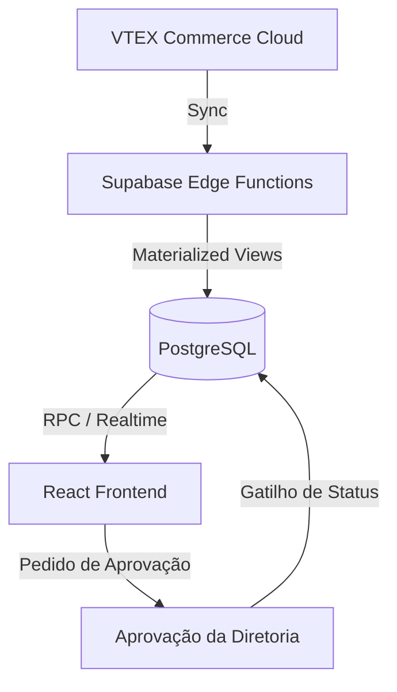

# Pardis SellerFlow

> Portal de Gestão de Cotações B2B de alta performance, integrando VTEX Commerce e Supabase.

O Pardis SellerFlow é um micro-serviço especializado projetado para capacitar equipes de vendas B2B com lógica de precificação complexa, cálculos tributários automatizados e um fluxo de aprovação simplificado.

---

## 🏗️ Arquitetura Técnica

### Core Stack
- **Frontend**: React 18 + Vite + TypeScript.
- **Estilização**: TailwindCSS + shadcn/ui (customizado para dashboards B2B de alta fidelidade).
- **Backend-as-a-Service**: Supabase (PostgreSQL, Realtime, Auth).
- **Camada de Integração**: Supabase Edge Functions (TypeScript/Deno) para sincronização com VTEX.
- **Lógica de Domínio**: `PricingService` desacoplado para cálculos precisos de unidades e embalagens B2B.

### Design do Sistema


---

## 💎 Principais Funcionalidades e Padrões UX

### 1. Engine de Precificação B2B
- **Exibição Focada em Embalagem**: Vendedores focam nos totais por embalagem, enquanto a engine gerencia o detalhamento por unidade e implicações fiscais (ST, ICMS, etc. - extensível via RPC).
- **Modos de Precificação Dinâmicos**: Integrados diretamente no seletor de produtos, permitindo alternar instantaneamente entre descontos percentuais e ajustes manuais.
- **Segurança de Margem**: Lógica de permissão avançada que oculta margens numéricas dos vendedores, exibindo apenas badges de status ("Autorizado/Pendente") para manter a confidencialidade do lucro.

### 2. Integração VTEX
- **Catálogo Materializado**: Dados da VTEX (Produtos, SKUs, Preços, Estoque) são normalizados em views do Supabase para performance de busca inferior a um segundo.
- **Sincronização Automatizada**: Edge Functions gerenciam atualizações periódicas e manuais via APIs de Master Data e Catálogo da VTEX.

---

## 🚀 Desenvolvimento

### Pré-requisitos
- Node.js 18+
- Supabase CLI (caso trabalhe com banco de dados local)

### Configuração
1. **Clonar e Instalar**:
   ```bash
   git clone <repo-url>
   npm install
   ```

2. **Configuração de Ambiente**:
   Crie um arquivo `.env.local`:
   ```env
   VITE_SUPABASE_URL="https://seu-projeto.supabase.co"
   VITE_SUPABASE_PUBLISHABLE_KEY="sua-anon-key"
   ```

3. **Executar**:
   ```bash
   npm run dev
   ```

### Estrutura do Projeto
- `/src/pages/seller-flow`: Processos centrais de cotação e aprovação.
- `/src/components/seller-flow`: Componentes UI reaproveitáveis específicos para B2B (Tabelas, Seletores).
- `/src/services`: Lógica de negócio desacoplada (Impostos, Precificação, Geração de PDF).
- `/supabase`: Migrações de banco de dados, definições de RPC e Edge Functions.

---

## 🛠️ Infraestrutura e CI/CD

- **Migrações de Banco**: Gerenciadas via fluxo de trabalho do Supabase (`db push`).
- **Edge Functions**: Deploy automático no push para a branch `main` via GitHub Actions.
- **Frontend**: Hospedado na Vercel com regras de rewrite SPA para o `react-router`.

---

## 📄 Documentação

Documentação detalhada disponível no diretório `/docs`:
- [Visão Geral da Arquitetura](file:///docs/ARCHITECTURE.md)
- [Guia de Deploy](file:///docs/DEPLOYMENT.md)
- [Schema do Banco de Dados](file:///docs/DATABASE.md)
- [Operações e Sincronização](file:///docs/OPERATIONS.md)

---
*Mantido pela Equipe de Desenvolvimento Pardis.*
